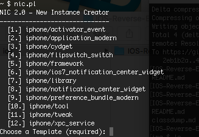

# Theos

---

## 安装Theos

1. 安装xcode，如果安装了多个xcode就用`sudo xcode-select -s /Applications/xcode.app/Contents/Developer`来选择默认的xcode

2. 下载theos

   从github上面下载theos，操作如下:

   ```shell
   export THEOS=/opt/theos
   sudo git clone https://github.com/theos/theos.git
   ```

3. 配置ldid

   ldid是专门用来签名ios可执行文件的工具，用以在越狱的ios中取代xcode自带的codesign，从[http://joedj.net/ldid](http://joedj.net/ldid)下载ldid，然后把它放到theos的bin目录下面，并且赋予可执行的权限

4. 配置dpkg

5. 配置环境变量

   配置环境变量THEOS，将theos的bin加到PATH环境变量中
   ```shell
   export THEOS=theos的路径
   export PATH=$PATH:$THEOS/bin
   ```

6. 测试是否装成功

   在终端执行`nic.pl`如果出现如下图就表示安装成功了  
   