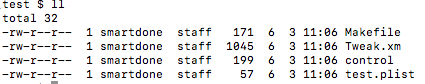

# Theos

---

## 安装Theos

1. 安装xcode，如果安装了多个xcode就用`sudo xcode-select -s /Applications/xcode.app/Contents/Developer`来选择默认的xcode

2. 下载theos

   从github上面下载theos，操作如下:

   ```shell
   export THEOS=/opt/theos
   sudo git clone https://github.com/theos/theos.git
   ```

3. 配置ldid

   ldid是专门用来签名ios可执行文件的工具，用以在越狱的ios中取代xcode自带的codesign，从[http://joedj.net/ldid](http://joedj.net/ldid)下载ldid，然后把它放到theos的bin目录下面，并且赋予可执行的权限

4. 配置dpkg

5. 配置环境变量

   配置环境变量THEOS，将theos的bin加到PATH环境变量中
   ```shell
   export THEOS=theos的路径
   export PATH=$PATH:$THEOS/bin
   ```

6. 测试是否装成功

   在终端执行`nic.pl`如果出现如下图就表示安装成功了  
   

## 创建工程

1. `nic.pl`
2. 输入11选择iPhone/tweak
3. `Project Name (required):`输入工程名
4. `Package Name [com.yourcompany.test]:`输入报名
5. `Author/Maintainer Name[xxxx]:`输入作者名字
6. `[iphone/tweak] MobileSubstrate Bundle filter [com.apple.springboard]:`输入作用的对象的bundle indentfier
7. 输入安装完之后需要重启的应用，以进程名称表示

> 创建完成之后，目录结构如下图。Makefile,Tweak.xm,control,xxx.plist文件



### Makefile

Makefile文件指定工程用到的文件、框架、库等信息，将整个过程自动化，Makefile文件的内容如下：

```Makefile
include $(THEOS)/makefiles/common.mk

TWEAK_NAME = test
test_FILES = Tweak.xm

include $(THEOS_MAKE_PATH)/tweak.mk

after-install::
	install.exec "killall -9 SpringBoard"
```

`TWEAK_NAME = test`是tweak的名字，就是用nic.pl创建工程的时候指定的"Project Name"，跟control文件中的“Name”对应，不要更改。

`test_FILES = Tweak.xm`是指tweak包含的源文件"不包括头文件"，多个文件用空格分隔

`include $(THEOS_MAKE_PATH)/tweak.mk`根据不同的theos类型，通过include命令指定不同的mk文件

`install.exec "killall -9 SpringBoard"`在安装之后杀掉SpringBoard好让cydiaSubstrate加载对应的dylib，和Android类似，我猜可能ios那些应用的进程可能都是SpringBoard给fork出来的，所以把它杀掉，重新打开的应用就会被注入dylib，

### Tweak.xm

tweak.xm是tweak默认生成的源文件。xm中的x代表支持Logos语法，xm代表支持Logos语法和C/C++语法。默认生成的代码如下：

```obj
/* How to Hook with Logos
Hooks are written with syntax similar to that of an Objective-C @implementation.
You don't need to #include <substrate.h>, it will be done automatically, as will
the generation of a class list and an automatic constructor.

%hook ClassName

// Hooking a class method
+ (id)sharedInstance {
	return %orig;
}

// Hooking an instance method with an argument.
- (void)messageName:(int)argument {
	%log; // Write a message about this call, including its class, name and arguments, to the system log.

	%orig; // Call through to the original function with its original arguments.
	%orig(nil); // Call through to the original function with a custom argument.

	// If you use %orig(), you MUST supply all arguments (except for self and _cmd, the automatically generated ones.)
}

// Hooking an instance method with no arguments.
- (id)noArguments {
	%log;
	id awesome = %orig;
	[awesome doSomethingElse];

	return awesome;
}

// Always make sure you clean up after yourself; Not doing so could have grave consequences!
%end
*/
```

- %hook只需要hook的class，必须以%end结尾
- %log指令在%hook内部使用，作用是讲函数的类名，参数等信息写入syslog
- %orig该指令在%hook内部使用，作用是执行hook的函数的原始代码
- %group用于对%hook分组，便于代码管理以及按条件初始化，必须以%end结束，一个%group可以包含多个%hook所有不属于某个自定义的group的%hook会被隐式的归类到%group_ungrouped中
- %new在%hook内部使用，给一个现有的class添加新函数，功能与class_addMethod相同
- %c该指令的作用等同于objc_getClass或者NSClassFromString，即动态获取一个类定义，在%hook或者%ctor中使用

### control

control文件中记录了deb包管理系统所需基本信息，会被打进deb包里面。control文件的内容如下：

```
Package: com.test
Name: test
Depends: mobilesubstrate
Version: 0.0.1
Architecture: iphoneos-arm
Description: An awesome MobileSubstrate tweak!
Maintainer: smartdone
Author: smartdone
Section: Tweaks
```

Package字段用于描述这个deb包的名字，采用的命名方式同bundle identifier类似，均为反向DNS格式，可以按需更改；

Name字段用于描述这个工程的名字，可以按需更改；

Depends字段用于描述deb的依赖，依赖是指这个程序运行的基本条件，可以填写固件版本或者其他程序，如果当前ios不满足依赖中定义的条件，则无法正常运行；

Version字段用来描述这个deb包的版本号，可以按需更改；

Architecture字段用于描述这个deb包安装的目标设备架构，不要更改哦；

Description字段用于描述deb包的维护人；

Author用于描述tweak的作者；

Section字段用于描述deb包所属的程序类别，不需要更改；